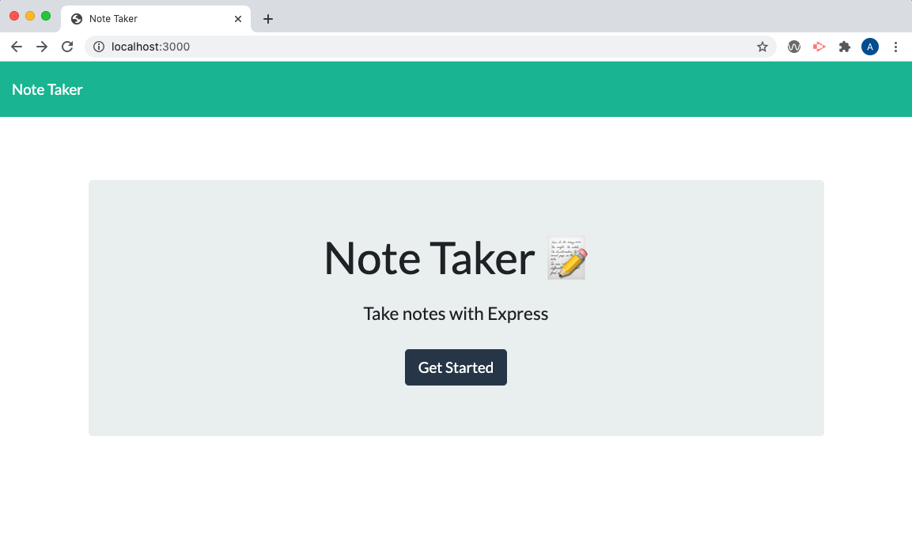
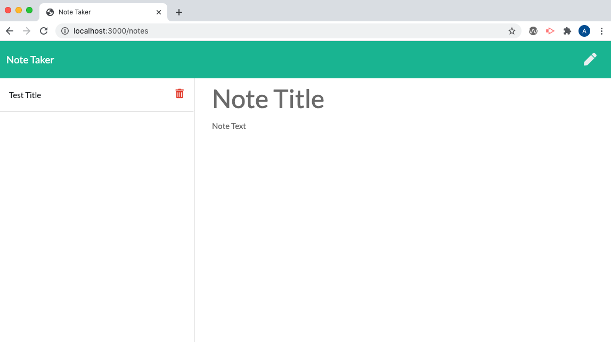
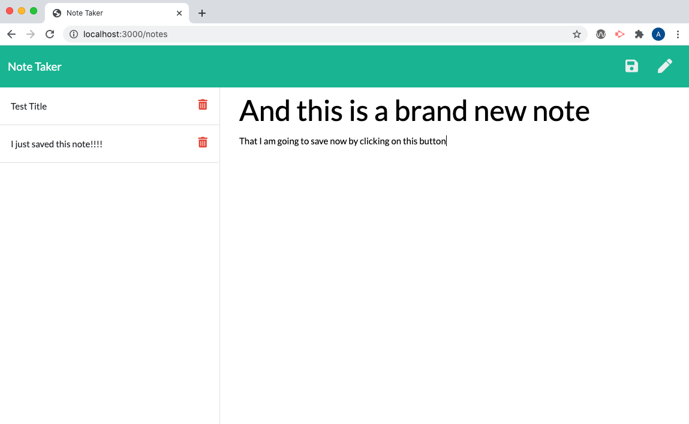

# Express Note Taker App  

## Watch video here
https://youtu.be/RPyvRdu8PhI

## Description
This project helps users organize their thoughts and keep track of tasks they need to complete through functionality that supports writing, saving, and deleting notes.

 This application uses an express backend and saves and retrieves note data from a JSON file. Finally, this app should be deployed on Heroku, as well (https://desolate-shore-43837.herokuapp.com/) 

## Table of Contents

- [Description](#description)
- [Installation](#installation)
- [Usage](#usage)
- [Contribution](#contribution)
- [Test](#test)
- [License](#license)
- [Questions](#questions) 
- [Screenshots](#screenshots)

### Installation
Please follow these unique installation instructions (if necessary): Make sure to run npm install and all dependencies including: "express" and "uniqid"

### Usage
This application’s code is free to use following the terms of the license identified. Additional usage instructions are: Same as license 

### Contribution
This applicating was made by Adam Jones with the assistance of Benjamin Benson (a tutor for the Rutgers Full Stack Coding Bootcamp). 

### Test 
I would not trust my code (or any code) without testing it myself. Please consider performing the following testing on this application prior to use: Take a look to validate that it worked before blindly pushing it to GitHub

### License               
This application is covered under the terms of the Artistic License 2.0 
Pease refer to their site for more details of the terms of use permittable.

### Questions

* If you have any questions or comments regarding this project, please contact me at adam.w.jones2@gmail.com and I will try to reply as soon as possible. 

* If you liked this project, please check out my GitHub page at adamwjones to see more of my work.

### Screenshots

* UI of home screen 

* UI of note taking screen  

* UI of saving a note 

